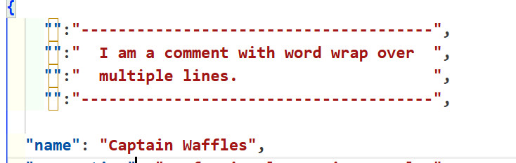

<h1> JSON Commenter</h1>

### Overview

JSON Commenter is a vscode extension that lets you create inline comments in a JSON file while keeping valid syntax. The text is edited inline and supports word wrap, padding, margins, etc. 

### Features

- Easy to use. A single command (default: ctrl-alt-') anywhere in the file opens a box in the nearest legal point.  Then clicking in that box opens an editor area where you enter the comment.  Then a click outside that area goes back to the box with the new text.

- The box has minimal surrounding chars which is more attractive than `"comment":"this is a comment",`

- It is highly customizable. The top and border lines are optional and can be any repeating string like `**~~**`. There can be any number of top margin blank lines and any number of bottom.  The lines will merge with existing blank lines like CSS margins. The padding on the left and right of text can be specified.  The overall indent is specified.  The width is changeable of course.

- The comment is inline which means it stays around when the file is closed. If you are in the middle of an edit when the file is closed that is also saved and can be continued when the file is opened.

### Where can it be used?

There are two general usage cases.  One is commenting in a config file for an app you are using.  It works great in package.json.  Almost all apps just look for specific properties and ignore others. In our limited testing we've found no apps that choke on the comments.

The other usage case is adding instructions to a config file for your own app.  When loading the json you can ignore the extra object properties or use code provided below to strip them.

### How does it work?

You might have noticed the property key values are empty.  This violates the rule of no duplicate keys.  

#### Author: Mark Hahn

#### Repo: https://github.com/eridien/vscode-json-commenter

#### Original Release: April 2025

#### License: MIT

Icons are provided by https://www.iconfinder.com.