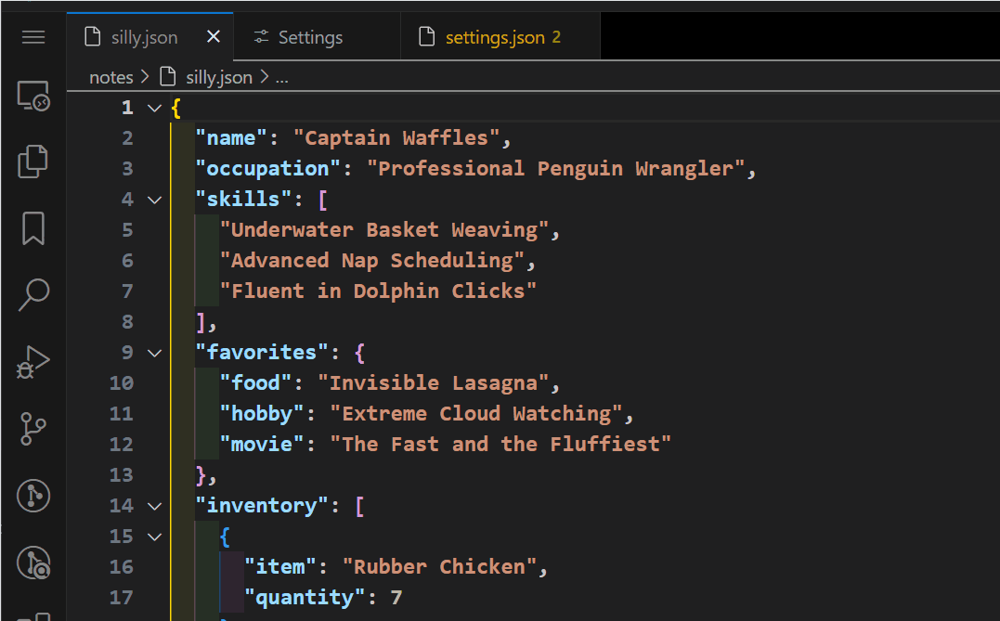

<h1> JSON Commenter</h1>

### Overview

JSON Commenter is a vscode extension that lets you create inline comments in a JSON file while keeping valid syntax. The text is edited inline and supports word wrap, padding, margins, etc. 



### Features

- Easy to use. See usage section below.

- The box has minimal surrounding chars which is more attractive than `"comment":"this is a comment",`


- It is highly customizable. The top and border lines are optional and can be any repeating string like `**~~**`. There can be any number of top margin blank lines and any number of bottom.  The lines will merge with existing blank lines like CSS margins. The padding on the left and right of text can be specified.  The overall indent is specified.  The width is changeable of course.

- The comment is inline which means it stays around when the file is closed. If you are in the middle of an edit when the file is closed that is also saved and can be continued when the file is opened.

### Usage instructions.

A single command (default: ctrl-alt-') anywhere in a json file opens a comment box at the nearest legal point. A setting determines if it opens above or below the click position.

Clicking in that box opens an editor area where you enter the comment. Use normal text editing. The lines can be as long as you want and the words will wrap in the box later. Single returns are ignored but double returns (a blank line) will create a break to end the line. 

A click anywhere outside the editing area will finish the editing and the box appears in it's final form.  You can reopen the editor at any time by just clicking inside the comment.

### Where can it be used?

There are two general usage cases.  One is commenting in a config file for an app you are using.  Almost all apps just look for specific properties and ignore others. For example: it works great in package.json. 

In our limited testing we've found no apps that choke on the comments.  If you find a problem app please post an issue in the repo.

The other usage case is adding instructions to a config file for your own app.  When loading the json you can ignore the extra object properties or use code provided below to strip them.

### How does it work?

You might have noticed the property key values are empty. This violates the rule of no duplicate keys.  But they aren't actually empty.  There are zero-width invisible characters for id numbers.  This not only guarantees no comment line duplicates but guarantees no duplicates with other normal keys.

The other tricky thing was finding legal points to insert comments. A full AST parser is used for that.

### Stripping comments when parsing.

As mentioned above when you are using the json file as config for your own app you can just ignore the extra properties or use this code ...

```
export function parseJsonWithComments(jsonText) {
  const recurs = obj => {
    if (Array.isArray(obj)) return obj.map(recurs);
    else if (obj && typeof obj === 'object') {
      const result = {};
      for (const key of Object.keys(obj)) {
        if (!/[\u200B\u200C\u200D\u2060]/.test(key)) 
          result[key] = recurs(obj[key]);
      }
      return result;
    }
    return obj;
  };
  return recurs(JSON.parse(jsonText));
}
```

#### Author: Mark Hahn

#### Repo: https://github.com/eridien/vscode-json-commenter

#### Original Release: June 2025

#### License: MIT
